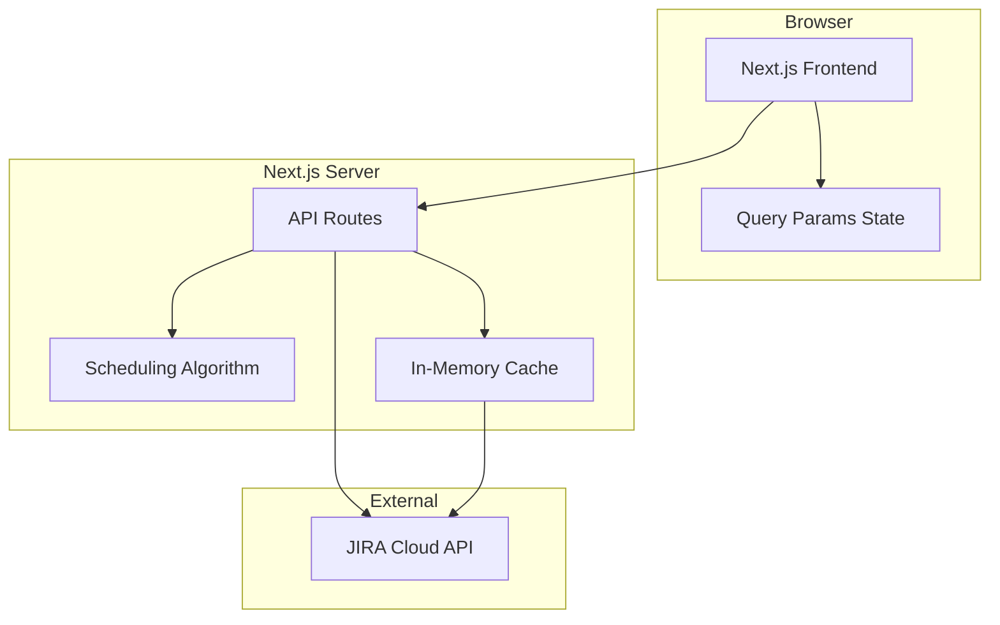
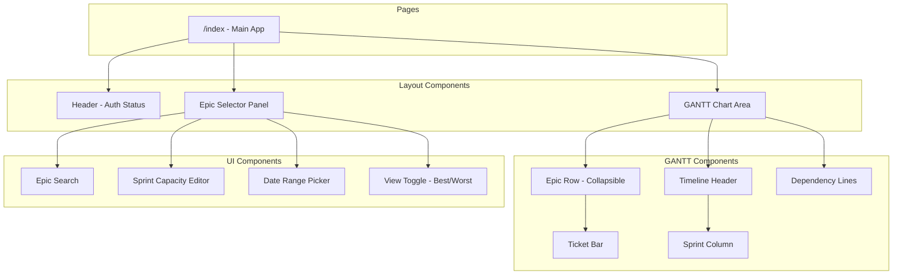
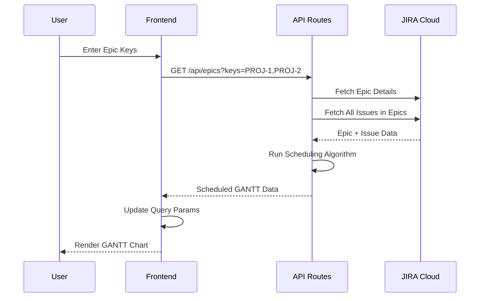

# Devdays JIRA GANTT - Implementation Plan

## Table of Contents

1. [Overview](#overview)
2. [Architecture](#architecture)
3. [Data Models](#data-models)
4. [Algorithm Design](#algorithm-design)
5. [API Design](#api-design)
6. [UI Wireframes](#ui-wireframes)
7. [Implementation Phases](#implementation-phases)
8. [Environment Configuration](#environment-configuration)

---

## Overview

### Goal
Build a Next.js application that connects to JIRA Cloud to create GANTT charts based on custom fields (Dev Days, Timeline Order) and optimally slots tickets across sprints to minimize total project duration.

### Key Features (MVP)
- JIRA Cloud integration via API Token
- Multi-epic GANTT visualization
- Sprint capacity-aware scheduling
- Best-fit algorithm for optimal ticket slotting
- Collapsible epic rows
- Query param-based state (shareable URLs)

---

## Architecture

### High-Level System Architecture



### Component Architecture



### Data Flow



---

## Data Models

### TypeScript Interfaces

```typescript
// JIRA Data Models
interface JiraCredentials {
  email: string;
  apiToken: string;
  baseUrl: string; // e.g., https://yourcompany.atlassian.net
}

interface JiraEpic {
  key: string;           // e.g., "PROJ-123"
  summary: string;       // Epic title
  status: string;        // e.g., "In Progress"
  order?: number;        // Custom field: Epic ordering (for future)
}

interface JiraTicket {
  key: string;           // e.g., "PROJ-456"
  summary: string;       // Ticket title
  status: string;
  epicKey: string;       // Parent epic
  devDays: number;       // Custom field: Story Points / Dev Days
  timelineOrder: number; // Custom field: Linear order within epic
  assignee?: string;
}

interface JiraSprint {
  id: number;
  name: string;
  state: 'active' | 'closed' | 'future';
  startDate: string;     // ISO date
  endDate: string;       // ISO date
}

// Sprint capacity is managed in-app (JIRA doesn't support custom fields on sprints)
interface SprintCapacity {
  sprintId: number;
  devDaysCapacity: number; // User-defined capacity for this sprint
}

// Scheduling Output Models
interface ScheduledTicket extends JiraTicket {
  startDay: number;      // Day offset from project start
  endDay: number;        // Day offset from project start
  sprintId: number;      // Which sprint it's slotted in
  parallelGroup: number; // For UI: which "lane" in parallel execution
}

interface ScheduledEpic extends JiraEpic {
  tickets: ScheduledTicket[];
  totalDevDays: number;
  startDay: number;
  endDay: number;
}

interface GanttData {
  epics: ScheduledEpic[];
  sprints: JiraSprint[];
  projectStartDate: string;
  projectEndDate: string;
  totalDevDays: number;
  viewMode: 'best' | 'worst';
}

// Query Param State (stored in URL for shareability)
interface AppState {
  epicKeys: string[];           // Selected epic keys (e.g., ["PROJ-1", "PROJ-2"])
  sprintCapacities: SprintCapacity[]; // Selected sprints with their capacities
  viewStartDate?: string;       // Chart X-axis start date (ISO)
  viewEndDate?: string;         // Chart X-axis end date (ISO)
  viewMode: 'best' | 'worst';
}

// Example URL:
// /?epics=PROJ-1,PROJ-2&sprints=1:20,2:18,3:20&viewMode=best&start=2024-01-01&end=2024-03-31
// (sprints format: sprintId:capacity pairs)
```

---

## Algorithm Design

### Goal
Minimize total calendar days to complete all selected epics, respecting:
1. Sprint capacity constraints
2. Ticket ordering within epics (timeline order)
3. Parallelism (tickets with same order can run concurrently)

### Best Case vs Worst Case

| Mode | Description | Algorithm |
|------|-------------|-----------|
| Best Case | Maximum parallelism | Tickets with same order overlap completely |
| Worst Case | No parallelism | All tickets execute sequentially |

### Algorithm: Optimal Slot Scheduling

```
┌─────────────────────────────────────────────────────────────────┐
│ ALGORITHM: MinimizeProjectDuration                              │
├─────────────────────────────────────────────────────────────────┤
│                                                                 │
│ INPUT:                                                          │
│   - epics[]: Array of epics with tickets                        │
│   - sprints[]: Array of sprints with capacity                   │
│   - viewMode: 'best' | 'worst'                                  │
│                                                                 │
│ OUTPUT:                                                         │
│   - scheduledEpics[]: Epics with scheduled tickets              │
│                                                                 │
│ PROCESS:                                                        │
│                                                                 │
│ 1. FLATTEN & GROUP                                              │
│    - Group tickets by (epicKey, timelineOrder)                  │
│    - Each group = parallel execution unit                       │
│                                                                 │
│ 2. CALCULATE GROUP DURATIONS                                    │
│    For each group:                                              │
│    - Best case: MAX(devDays) in group                           │
│    - Worst case: SUM(devDays) in group                          │
│                                                                 │
│ 3. BUILD DEPENDENCY GRAPH                                       │
│    - Groups with order N depend on all groups with order < N    │
│    - Within same epic only (for MVP)                            │
│                                                                 │
│ 4. TOPOLOGICAL SORT                                             │
│    - Sort groups by dependencies                                │
│    - Groups with no deps can start immediately                  │
│                                                                 │
│ 5. SLOT INTO SPRINTS                                            │
│    For each group in sorted order:                              │
│    - Find earliest sprint with available capacity               │
│    - If capacity insufficient, span multiple sprints            │
│    - Update sprint remaining capacity                           │
│    - Record start/end days                                      │
│                                                                 │
│ 6. RETURN scheduled data with day offsets                       │
│                                                                 │
└─────────────────────────────────────────────────────────────────┘
```

### Visual Example

**Input:**
```
Epic PROJ-1:
  PROJ-10: 2 dev days, order 1
  PROJ-11: 3 dev days, order 2
  PROJ-12: 2 dev days, order 2  (parallel with PROJ-11)
  PROJ-13: 1 dev day,  order 3

Sprint 1: 5 dev days capacity (Days 1-5)
Sprint 2: 5 dev days capacity (Days 6-10)
```

**Best Case Output:**
```
Day:      1    2    3    4    5    6    7    8
          ├────┼────┼────┼────┼────┼────┼────┤
PROJ-10   ████████                              (order 1: 2 days)
PROJ-11             ██████████████              (order 2: 3 days)
PROJ-12             ████████                    (order 2: 2 days, parallel)
PROJ-13                           ██████        (order 3: 1 day)
          └────────────────────────────────┘
          Total: 6 days (2 + 3 + 1, parallel tickets overlap)
```

**Worst Case Output:**
```
Day:      1    2    3    4    5    6    7    8
          ├────┼────┼────┼────┼────┼────┼────┤
PROJ-10   ████████                              (2 days)
PROJ-11             ██████████████              (3 days)
PROJ-12                           ████████      (2 days, serialized)
PROJ-13                                   ████  (1 day)
          └────────────────────────────────────┘
          Total: 8 days (2 + 3 + 2 + 1, all sequential)
```

### Sprint Capacity Algorithm

```
┌─────────────────────────────────────────────────────────────────┐
│ FUNCTION: slotTicketIntoSprints(ticket, sprints, currentDay)    │
├─────────────────────────────────────────────────────────────────┤
│                                                                 │
│ remainingWork = ticket.devDays                                  │
│ startDay = currentDay                                           │
│                                                                 │
│ FOR each sprint starting from currentDay:                       │
│   IF sprint.remainingCapacity > 0:                              │
│     workInSprint = MIN(remainingWork, sprint.remainingCapacity) │
│     sprint.remainingCapacity -= workInSprint                    │
│     remainingWork -= workInSprint                               │
│                                                                 │
│     IF remainingWork == 0:                                      │
│       RETURN {                                                  │
│         startDay,                                               │
│         endDay: currentDayInSprint                              │
│       }                                                         │
│                                                                 │
│ THROW "Insufficient sprint capacity"                            │
│                                                                 │
└─────────────────────────────────────────────────────────────────┘
```

---

## API Design

### Endpoints

| Method | Endpoint | Description |
|--------|----------|-------------|
| GET | `/api/auth/validate` | Validate JIRA credentials |
| GET | `/api/epics/search` | Search epics by query |
| GET | `/api/epics/[key]` | Get single epic with tickets |
| POST | `/api/gantt/generate` | Generate scheduled GANTT data |
| GET | `/api/sprints` | List sprints for a board |

### API Route Details

#### `POST /api/gantt/generate`

**Request:**
```json
{
  "epicKeys": ["PROJ-1", "PROJ-2"],
  "sprintIds": [1, 2, 3, 4],
  "viewMode": "best",
  "startDate": "2024-01-01",
  "endDate": "2024-03-31"
}
```

**Response:**
```json
{
  "epics": [
    {
      "key": "PROJ-1",
      "summary": "User Authentication",
      "startDay": 0,
      "endDay": 15,
      "totalDevDays": 12,
      "tickets": [
        {
          "key": "PROJ-10",
          "summary": "Login page",
          "devDays": 3,
          "timelineOrder": 1,
          "startDay": 0,
          "endDay": 3,
          "sprintId": 1,
          "parallelGroup": 0
        }
      ]
    }
  ],
  "sprints": [...],
  "projectStartDate": "2024-01-01",
  "projectEndDate": "2024-02-15",
  "totalDevDays": 45,
  "viewMode": "best"
}
```

#### `GET /api/epics/search?q=auth`

**Response:**
```json
{
  "results": [
    { "key": "PROJ-1", "summary": "User Authentication" },
    { "key": "PROJ-5", "summary": "OAuth Integration" }
  ]
}
```

---

## UI Wireframes

### Main Application Layout

```
┌─────────────────────────────────────────────────────────────────────────────────────┐
│ HEADER                                                                              │
│ ┌─────────────────────────────────────┐  ┌──────────────────────────────────────┐   │
│ │ 📊 DevDays GANTT Chart              │  │ ✓ Connected: rob@company.com         │   │
│ └─────────────────────────────────────┘  └──────────────────────────────────────┘   │
├─────────────────────────────────────────────────────────────────────────────────────┤
│                                                                                     │
│ ┌─────────────────────┐ ┌─────────────────────────────────────────────────────────┐ │
│ │ SIDEBAR             │ │ GANTT CHART                                             │ │
│ │                     │ │                                                         │ │
│ │ ┌─────────────────┐ │ │ ┌───────────────────────────────────────────────────┐   │ │
│ │ │ 🔍 Search Epics │ │ │ │ TIMELINE HEADER                                   │   │ │
│ │ │ [PROJ-123     ] │ │ │ │                                                   │   │ │
│ │ └─────────────────┘ │ │ │         │ Sprint 1      │ Sprint 2      │ Sprint 3│   │ │
│ │                     │ │ │         │ Jan 1-14      │ Jan 15-28     │ Jan 29  │   │ │
│ │ ── OR ──            │ │ │         │ Cap: 20 DD    │ Cap: 18 DD    │ Cap: 20 │   │ │
│ │                     │ │ │ Epic    ├───────────────┼───────────────┼─────────│   │ │
│ │ ┌─────────────────┐ │ │ │ /Ticket │ 1  2  3  4  5 │ 6  7  8  9 10 │11 12 13 │   │ │
│ │ │ Paste Epic Keys │ │ │ ├─────────┼───────────────┼───────────────┼─────────│   │ │
│ │ │ ┌─────────────┐ │ │ │ │         │               │               │         │   │ │
│ │ │ │PROJ-1       │ │ │ │ │ ▼ EPIC-1│ ████████████████████          │         │   │ │
│ │ │ │PROJ-2       │ │ │ │ │  Auth   │               │               │         │   │ │
│ │ │ │PROJ-3       │ │ │ │ │   │     │               │               │         │   │ │
│ │ │ │             │ │ │ │ │   ├─ T1 │ ██████        │               │         │   │ │
│ │ │ └─────────────┘ │ │ │ │   ├─ T2 │       ████████│               │         │   │ │
│ │ │ [Load Epics]    │ │ │ │   └─ T3 │       ████████│               │         │   │ │
│ │ └─────────────────┘ │ │ │         │               │               │         │   │ │
│ │                     │ │ │ ▶ EPIC-2│               │ ██████████████│█████████│   │ │
│ │ ┌─────────────────┐ │ │ │  Search │  (collapsed)  │               │         │   │ │
│ │ │ SELECTED EPICS  │ │ │ │         │               │               │         │   │ │
│ │ │                 │ │ │ │ ▼ EPIC-3│               │               │ ████████│   │ │
│ │ │ • PROJ-1 Auth ×│ │ │ │  API    │               │               │         │   │ │
│ │ │ • PROJ-2 Srch ×│ │ │ │   │     │               │               │         │   │ │
│ │ │ • PROJ-3 API  ×│ │ │ │   ├─ T7 │               │               │ ████    │   │ │
│ │ │                 │ │ │ │   └─ T8 │               │               │     ████│   │ │
│ │ └─────────────────┘ │ │ │         │               │               │         │   │ │
│ │                     │ │ └───────────────────────────────────────────────────┘   │ │
│ │ ┌─────────────────┐ │ │                                                         │ │
│ │ │ VIEW MODE       │ │ │ ┌───────────────────────────────────────────────────┐   │ │
│ │ │ ○ Best Case     │ │ │ │ SUMMARY                                           │   │ │
│ │ │ ● Worst Case    │ │ │ │ Total Dev Days: 45  |  Duration: 32 days          │   │ │
│ │ └─────────────────┘ │ │ │ Start: Jan 1, 2024  |  End: Feb 1, 2024           │   │ │
│ │                     │ │ └───────────────────────────────────────────────────┘   │ │
│ │ ┌─────────────────┐ │ │                                                         │ │
│ │ │ SPRINT CAPACITY │ │ └─────────────────────────────────────────────────────────┘ │
│ │ │ (Dev Days/Sprint│ │                                                             │
│ │ │                 │ │                                                             │
│ │ │ ☑ Sprint 1 [20] │ │                                                             │
│ │ │ ☑ Sprint 2 [18] │ │                                                             │
│ │ │ ☑ Sprint 3 [20] │ │                                                             │
│ │ │ ☐ Sprint 4 [  ] │ │                                                             │
│ │ │ ☐ Sprint 5 [  ] │ │                                                             │
│ │ │                 │ │                                                             │
│ │ │ Default: [20]   │ │                                                             │
│ │ └─────────────────┘ │                                                             │
│ │                     │                                                             │
│ │ ┌─────────────────┐ │                                                             │
│ │ │ VIEW DATE RANGE │ │                                                             │
│ │ │ (X-Axis Bounds) │ │                                                             │
│ │ │ Start: [Jan 1 ] │ │                                                             │
│ │ │ End:   [Mar 31] │ │                                                             │
│ │ └─────────────────┘ │                                                             │
│ │                     │                                                             │
│ │ [Generate GANTT]    │                                                             │
│ └─────────────────────┘                                                             │
│                                                                                     │
└─────────────────────────────────────────────────────────────────────────────────────┘
```

### Authentication

Authentication is handled entirely via environment variables (no UI needed):

```bash
# .env.local
JIRA_BASE_URL=https://yourcompany.atlassian.net
JIRA_EMAIL=your.email@company.com
JIRA_API_TOKEN=your-api-token-here
```

The app will show a connection status in the header but no configuration UI.

### Ticket Detail Tooltip (on hover)

```
┌─────────────────────────────────────────┐
│ PROJ-456: Implement login form          │
├─────────────────────────────────────────┤
│ Status:    In Progress                  │
│ Dev Days:  3                            │
│ Order:     2                            │
│ Sprint:    Sprint 1                     │
│ Assignee:  John Doe                     │
├─────────────────────────────────────────┤
│ Scheduled: Day 4 → Day 6                │
│ Duration:  3 days                       │
├─────────────────────────────────────────┤
│ 🔗 Open in JIRA                         │
└─────────────────────────────────────────┘
```

---

## Implementation Phases

### Phase 1: Foundation (Core Setup)
**Files to create/modify:**

```
src/
├── app/
│   ├── layout.tsx           # Root layout with MUI theme
│   ├── page.tsx             # Main app page
│   └── api/
│       ├── auth/
│       │   └── validate/route.ts
│       ├── epics/
│       │   ├── search/route.ts
│       │   └── [key]/route.ts
│       ├── sprints/route.ts
│       └── gantt/
│           └── generate/route.ts
├── lib/
│   ├── jira/
│   │   ├── client.ts        # JIRA API client
│   │   ├── types.ts         # TypeScript interfaces
│   │   └── mappers.ts       # Map JIRA response to our types
│   └── scheduler/
│       ├── algorithm.ts     # Core scheduling algorithm
│       └── types.ts
├── components/
│   └── (empty for now)
└── styles/
    └── theme.ts             # MUI theme configuration
```

**Tasks:**
1. Set up MUI with Emotion
2. Create JIRA API client with auth
3. Implement environment variable configuration
4. Create TypeScript interfaces
5. Set up basic page layout

### Phase 2: JIRA Integration
**Tasks:**
1. Implement `/api/auth/validate` endpoint
2. Implement `/api/epics/search` endpoint
3. Implement `/api/epics/[key]` endpoint with ticket fetching
4. Implement `/api/sprints` endpoint
5. Handle custom field mapping (via env vars)
6. Add error handling and loading states

### Phase 3: Scheduling Algorithm
**Tasks:**
1. Implement ticket grouping by timeline order
2. Implement best-case duration calculator
3. Implement worst-case duration calculator
4. Implement dependency graph builder
5. Implement sprint capacity slotting
6. Implement `/api/gantt/generate` endpoint
7. Add unit tests for algorithm

### Phase 4: UI Components
**Tasks:**
1. Create Epic Search component
2. Create Epic Key Paste input
3. Create Selected Epics list
4. Create View Mode toggle (best/worst case)
5. Create Sprint Capacity Editor (checkbox + capacity input per sprint)
6. Create Date Range picker (view bounds)

### Phase 5: GANTT Chart
**Tasks:**
1. Create Timeline Header component
2. Create Sprint Column component
3. Create Epic Row (collapsible) component
4. Create Ticket Bar component
5. Implement horizontal scrolling
6. Implement ticket hover tooltips
7. Add ticket click → JIRA link

### Phase 6: State & Polish
**Tasks:**
1. Implement query param serialization/deserialization
2. Add URL sharing functionality
3. Add loading skeletons
4. Add error boundaries
5. Add empty states
6. Performance optimization (virtualization if needed)

---

## Environment Configuration

### Required Environment Variables

```bash
# .env.local

# JIRA Authentication (required)
JIRA_BASE_URL=https://yourcompany.atlassian.net
JIRA_EMAIL=your.email@company.com
JIRA_API_TOKEN=your-api-token-here
# Generate token at: https://id.atlassian.com/manage-profile/security/api-tokens

# JIRA Custom Field IDs (required)
# Find these in JIRA Admin → Issues → Custom Fields
JIRA_FIELD_DEV_DAYS=customfield_10001          # Story Points / Dev Days
JIRA_FIELD_TIMELINE_ORDER=customfield_10002     # Timeline Order

# Board ID for fetching sprints (required)
JIRA_BOARD_ID=123
```

### Field Mapping Configuration

The custom field IDs are configurable because they vary between JIRA instances:

| Our Field | JIRA Equivalent | Description |
|-----------|-----------------|-------------|
| `devDays` | Story Points (usually) | Number of dev days estimate |
| `timelineOrder` | Custom Field | Linear ordering for dependencies |

**Note:** Sprint capacity is NOT a JIRA field (JIRA doesn't support custom fields on sprints).
Instead, users enter capacity per sprint directly in the app UI.

---

## File Structure (Complete)

```
devdays-jira-gantt/
├── src/
│   ├── app/
│   │   ├── layout.tsx
│   │   ├── page.tsx
│   │   ├── globals.css
│   │   └── api/
│   │       ├── auth/
│   │       │   └── validate/route.ts
│   │       ├── epics/
│   │       │   ├── search/route.ts
│   │       │   └── [key]/route.ts
│   │       ├── sprints/route.ts
│   │       └── gantt/
│   │           └── generate/route.ts
│   ├── lib/
│   │   ├── jira/
│   │   │   ├── client.ts
│   │   │   ├── types.ts
│   │   │   └── mappers.ts
│   │   ├── scheduler/
│   │   │   ├── algorithm.ts
│   │   │   ├── types.ts
│   │   │   └── __tests__/
│   │   │       └── algorithm.test.ts
│   │   └── utils/
│   │       └── queryParams.ts
│   ├── components/
│   │   ├── layout/
│   │   │   ├── Header.tsx
│   │   │   ├── Sidebar.tsx
│   │   │   └── MainContent.tsx
│   │   ├── gantt/
│   │   │   ├── GanttChart.tsx
│   │   │   ├── TimelineHeader.tsx
│   │   │   ├── SprintColumn.tsx
│   │   │   ├── EpicRow.tsx
│   │   │   ├── TicketBar.tsx
│   │   │   └── TicketTooltip.tsx
│   │   └── sidebar/
│   │       ├── EpicSearch.tsx
│   │       ├── EpicKeyPaste.tsx
│   │       ├── SelectedEpics.tsx
│   │       ├── ViewModeToggle.tsx
│   │       ├── SprintCapacityEditor.tsx
│   │       └── DateRangePicker.tsx
│   ├── hooks/
│   │   ├── useJiraAuth.ts
│   │   ├── useGanttData.ts
│   │   └── useQueryParams.ts
│   └── styles/
│       └── theme.ts
├── public/
├── .env.local.example
├── package.json
├── tsconfig.json
├── next.config.js
├── PROJECT-DESIGN.md
└── IMPLEMENTATION-PLAN.md
```

---

## Next Steps

Ready to begin implementation? Start with **Phase 1: Foundation** by:

1. Installing dependencies:
   ```bash
   yarn add @mui/material @emotion/react @emotion/styled
   ```

2. Creating the base file structure

3. Setting up the MUI theme

Would you like me to proceed with Phase 1?
